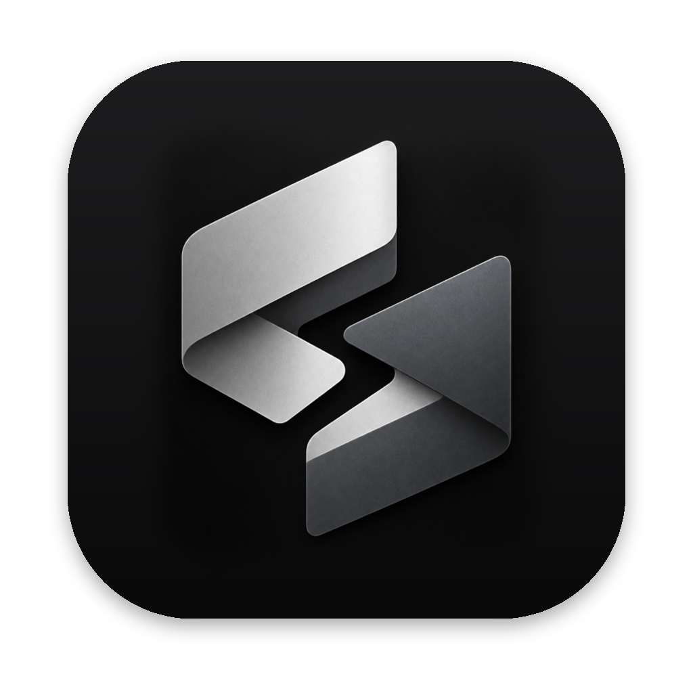
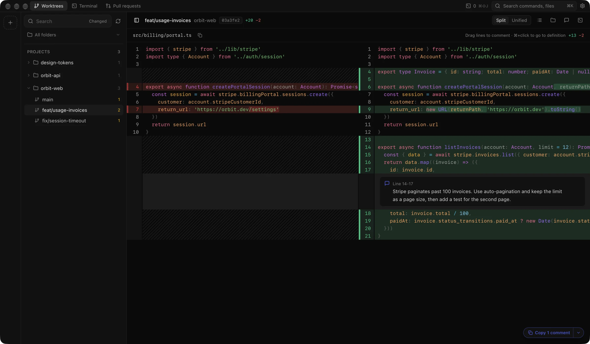
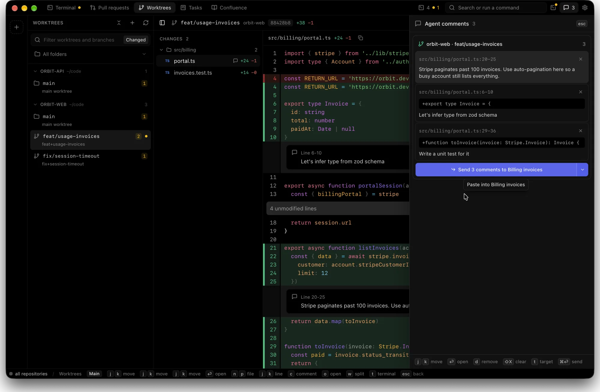
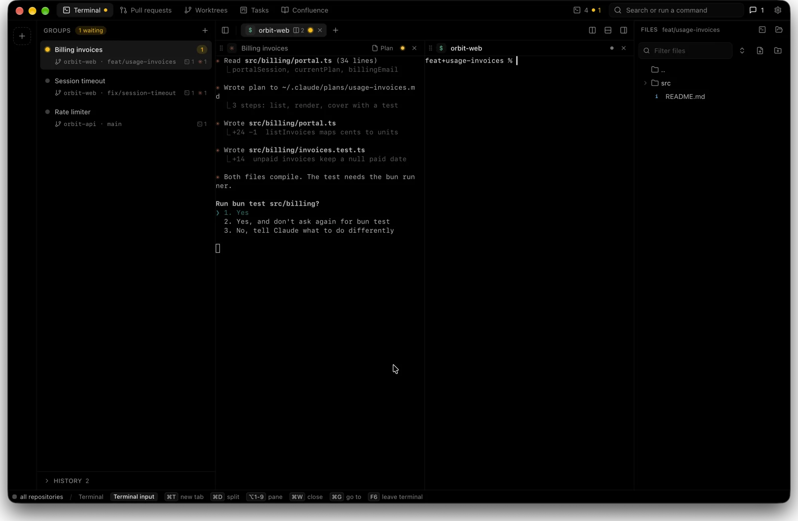
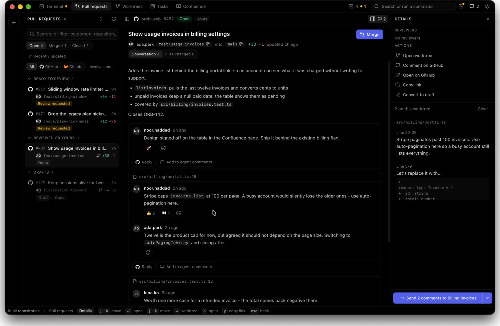

<div align="center">



# Treeix

**Review what your coding agents did - worktrees, diffs, pull requests, tasks and terminals in one window.**

[](LICENSE)
[](#install)
[](https://www.electronjs.org/)
[](https://react.dev/)
[](https://bun.sh/)
[](packages/README.md)

[Download](https://treeix.dyvertex.com/download) · [Website](https://treeix.dyvertex.com) · [Plugin docs](packages/README.md) · [Architecture](docs/architecture.md)



</div>

## Why

Agents write code faster than anyone can read it. The reading is the bottleneck, and it is spread across a terminal, a git client, a browser tab per pull request and a tracker. Treeix puts one worktree, its diff, its review comments, its pull request and the agent session that produced it on a single screen, and sends your comments straight back to the agent.

## What it does

- **Worktrees.** Every repository and checkout in your folders, with the diff against the base branch, split or unified.
- **Review in place.** Select lines, leave comments, then send them to a Claude or Codex session or copy them out.
- **Sessions that survive.** Claude, Codex and shell sessions keep running across reloads, docked next to the diff or in their own tab.
- **Pull requests.** GitHub and GitLab, through `gh` and `glab`: threads, viewed files, conflict and CI state.
- **Tasks and pages.** Jira work items and Confluence pages through the Atlassian CLI, with link previews anywhere a URL appears.
- **Markdown that behaves.** Foldable headings, mermaid diagrams, images from private uploads, full screen with zoom.
- **Everything is a plugin.** Each feature above can be switched off in Settings and stops loading its code entirely.

## Before and after

| | Before | With Treeix |
| --- | --- | --- |
| Read the ticket | Jira in a browser tab | Tasks page, grouped by whose move it is |
| Find the spec | Search Confluence, keep the tab open all day | The page beside the branch, one keystroke to an agent |
| See what changed | `cd` into the worktree, `git diff`, scroll | Every worktree in one sidebar, diff already open |
| Leave feedback | Copy the file and the line numbers into a prompt | Drag across the lines, write the note, send the queue |
| Reviewer's comment | GitHub or GitLab tab, then retype it for the agent | Add to agent comments, one click |
| Closed a session | The conversation is gone, start a new one | History reopens it and the agent resumes |
| Switch agents | `git checkout`, hope nothing is dirty | Click the group, its worktree is already there |

## Screenshots

**Every worktree, its diff and your comments on one screen.** Split or unified, comments sit on the lines they belong to.


**Comments go back to the agent.** Select lines, write the note, send the whole queue to the Claude Code or Codex session running in that worktree as its next prompt.



**A group per agent.** Its worktree, its terminals, its plan, and a badge the moment one waits for an answer.



**Pull requests, tickets and specs in the same window.** A reviewer's comment becomes an agent task with one click.



## Install

Download the DMG from [treeix.dyvertex.com/download](https://treeix.dyvertex.com/download). Apple silicon, macOS 14 or newer.

Build it yourself:

```sh
bun install
bun run dev
```

Optional command line tools, each feature degrades without its own: `gh`, `glab`, `acli`, `claude`, `codex`.

## Plugins

The host in `apps/desktop` owns workspaces, worktrees, diffs, the editor, comments and settings. Everything else ships as a plugin in [`packages/plugins`](packages/plugins).

| Plugin | Default | What it adds |
| --- | --- | --- |
| [`terminal`](packages/plugins/terminal) | on | Terminal tab, docked panel, Claude, Codex and shell sessions |
| [`pull-requests`](packages/plugins/pull-requests) | on | GitHub and GitLab pull requests, review threads, conflicts |
| [`plans`](packages/plugins/plans) | on | Claude plans in the palette and on sessions |
| [`usage-limits`](packages/plugins/usage-limits) | on | Claude and Codex 5-hour and weekly limits in the title bar |
| [`diagrams`](packages/plugins/diagrams) | on | Mermaid code blocks, loaded on the first diagram |
| [`keep-awake`](packages/plugins/keep-awake) | on | Keeps the Mac awake while an agent is working |
| [`jira`](packages/plugins/jira) | off | Jira work items, status changes, worktree per item |
| [`confluence`](packages/plugins/confluence) | off | Confluence pages, search, spaces, link previews |

Writing one takes a `package.json` and a `renderer/index.tsx`: see [packages/README.md](packages/README.md).

## Development

```sh
bun install        # installs both apps and links packages/node_modules
bun run dev        # electron-vite dev
bun run typecheck  # tsc, both projects
bun run test       # bun test, app and packages
```

Repository layout:

```
apps/desktop    the Electron app (main, preload, renderer)
apps/landing    static landing page for treeix.dyvertex.com
packages/sdk    the plugin contract
packages/plugins  the plugins
packages/atlassian  shared acli, Atlassian Document Format, credentials
```

More: [architecture](docs/architecture.md) · [releasing](docs/releasing.md) · [contributing](CONTRIBUTING.md) · [security](SECURITY.md)

## License

[Apache License 2.0](LICENSE). You may use, modify and redistribute Treeix, including commercially, as long as you keep the license and the [NOTICE](NOTICE) file and state your changes. Forks and derivative works must credit Treeix:

> Built on Treeix (https://treeix.dyvertex.com), Copyright 2026 Treeix contributors, licensed under the Apache License 2.0.

The name and the icons are trademarks and are not part of the license grant.
