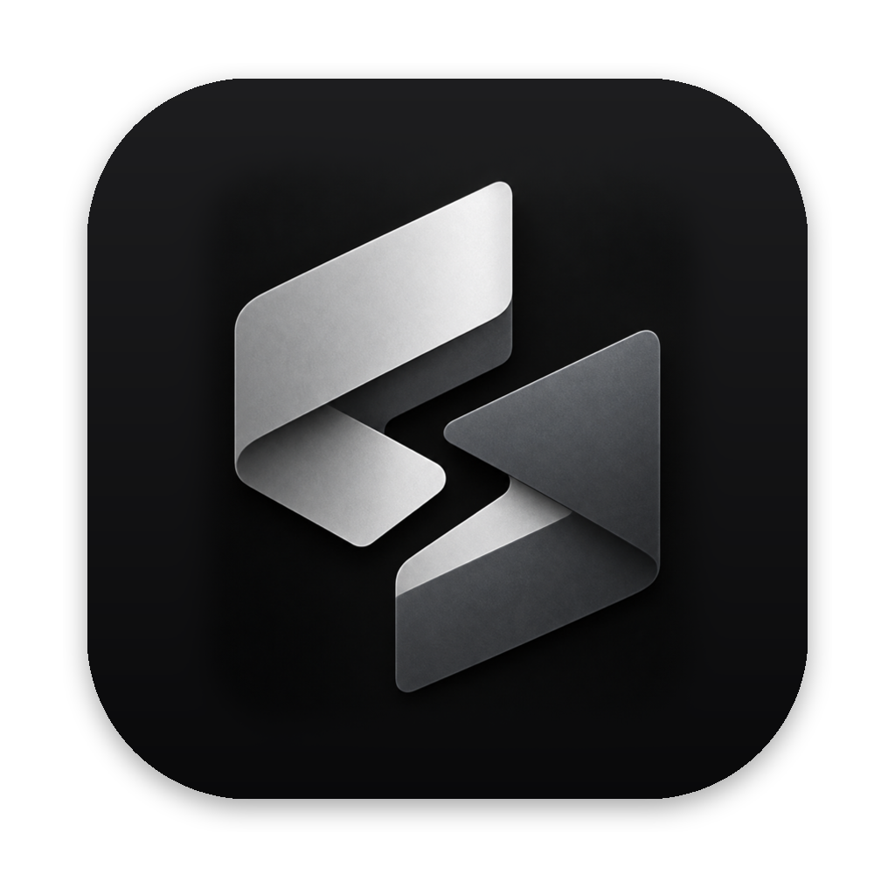
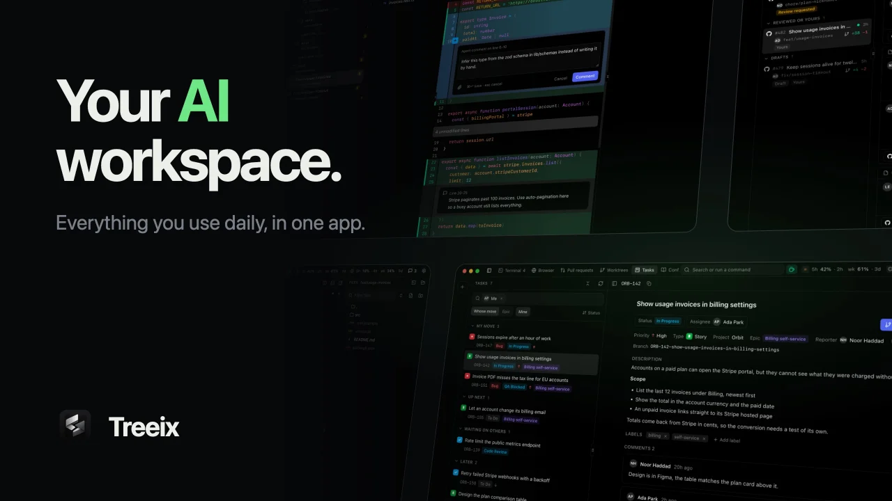
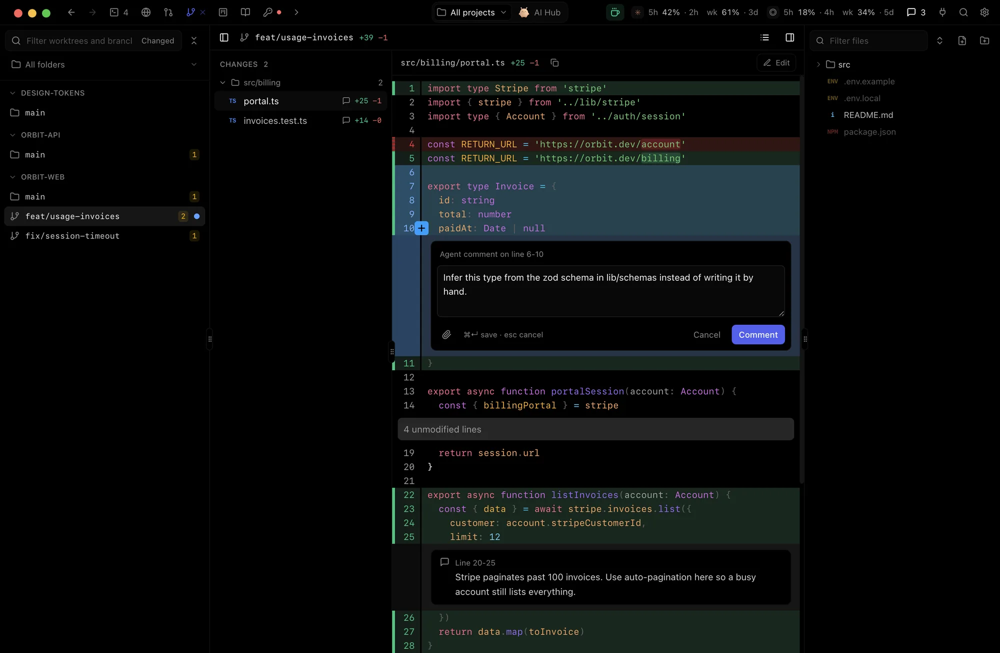
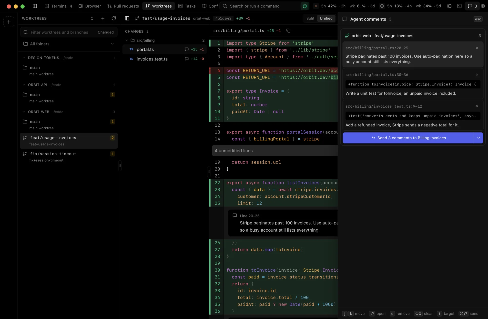
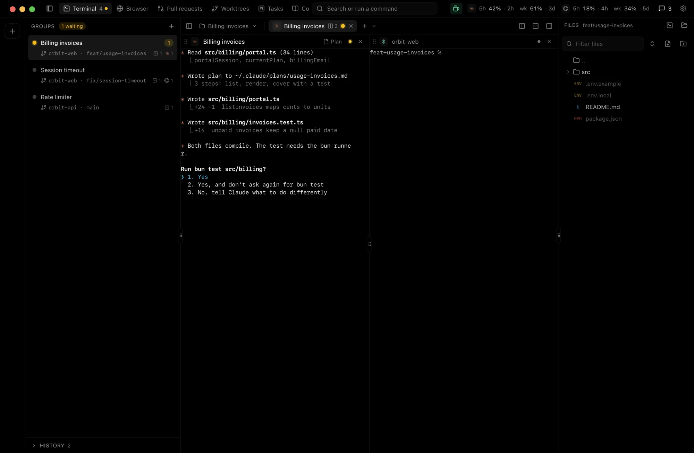
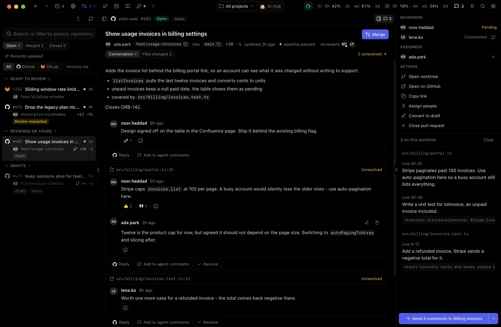
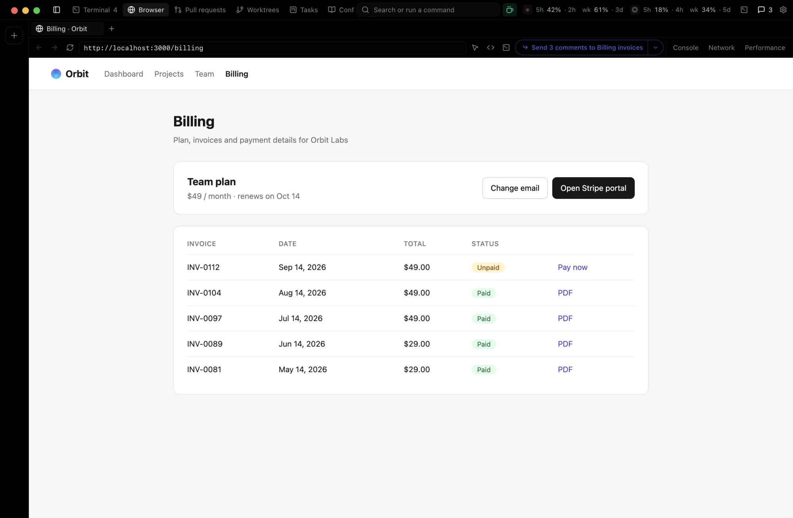
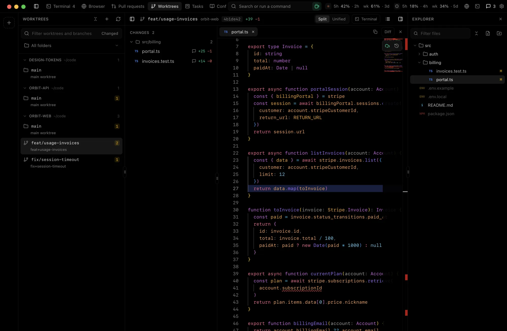
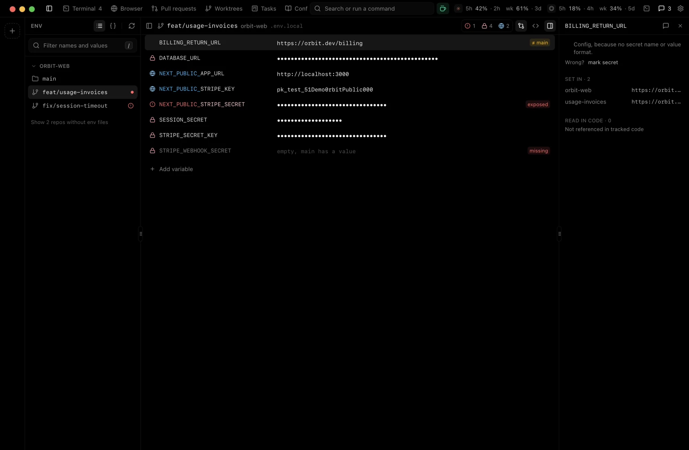
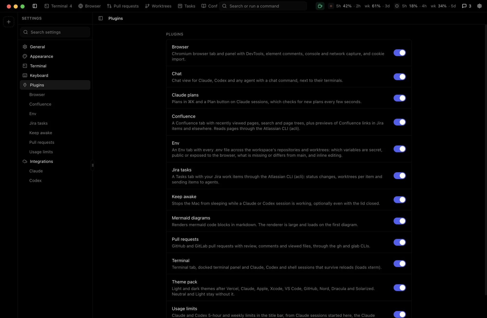

<div align="center">



# Treeix

**Your AI workspace. Everything you use daily, in one app.**

Agents, worktrees, diffs, pull requests and tickets in one Mac app, and your review notes go back to the agent as its next prompt.

[](LICENSE)
[](#install)
[](https://www.electronjs.org/)
[](https://react.dev/)
[](https://bun.sh/)
[](packages/README.md)

[Download](https://treeix.dyvertex.com/download) · [Website](https://treeix.dyvertex.com) · [Plugin docs](packages/README.md) · [Architecture](docs/architecture.md)

<a href="https://youtu.be/Un4AvXgqtAM"></a>

[Watch the 80-second tour](https://youtu.be/Un4AvXgqtAM)

</div>

## Why

AI agents write code faster than anyone can read it. The reading is the bottleneck, and it is spread across a terminal, a git client, a browser tab per pull request and a tracker. Treeix puts one worktree, its diff, its review comments, its pull request and the agent session that produced it on a single screen, and sends your comments straight back to the agent.

## What it does

- **Worktrees.** Every repository and checkout in your folders shows up in one sidebar, with the diff against the base branch, split or unified.
- **Review in place.** Select lines, leave comments, then send them to a Claude or Codex session or copy them out.
- **Sessions keep running.** Claude, Codex, a shell or any CLI agent you add survive a reload, docked next to the diff or in their own tab.
- **Pull requests.** `gh` and `glab` bring GitHub and GitLab pull requests in with their review threads, viewed files, conflict and CI state.
- **Tasks and pages.** The Atlassian CLI opens Jira work items and Confluence pages beside the branch, and a URL previews wherever you paste it.
- **Browser.** A Chromium tab with DevTools for the app your agent is building. Comment on an element and the note joins the same queue as your code comments.
- **Editor.** Fix a line yourself in the built-in editor. Every save keeps a snapshot you can go back to.
- **Env.** Every `.env` file across your worktrees in one table: what is secret, what is exposed to the browser, what is missing or differs from `main`.
- **Usage limits.** Claude and Codex 5-hour and weekly limits in the title bar, so a long run does not stop by surprise.
- **History.** Closed sessions stay in History. Reopen one and the agent picks up the same conversation.
- **Markdown.** Headings fold, mermaid blocks render, private uploads load their images, and full screen zooms.
- **Everything is a plugin.** Switch any feature above off in Settings and it stops loading its code entirely.

## Before and after

| | Before | With Treeix |
| --- | --- | --- |
| Read the ticket | Jira in a browser tab | Tasks page, grouped by whose move it is |
| Find the spec | Search Confluence, keep the tab open all day | The page beside the branch, one keystroke to an agent |
| See what changed | `cd` into the worktree, `git diff`, scroll | Every worktree in one sidebar, diff already open |
| Leave feedback | Copy the file and the line numbers into a prompt | Drag across the lines, write the note, send the queue |
| Reviewer's comment | GitHub or GitLab tab, then retype it for the agent | Add to agent comments, one click |
| Closed a session | The conversation is gone, start a new one | History reopens it and the agent resumes |
| Switch agents | `git checkout`, hope nothing is dirty | Click the group, its worktree is already there |

## Screenshots

**Every worktree, its diff and your comments on one screen.** Split or unified, comments sit on the lines they belong to.



**Comments go back to the agent.** Select the lines that need another pass and write your note. The whole queue then goes to the Claude Code or Codex session running in that worktree as its next prompt.



**A group per agent.** A group holds one agent's worktree, terminals and plan, and it gets a badge the moment that agent waits for an answer.



**Pull requests, tickets and specs in the same window.** A reviewer's comment becomes an agent task with one click.



**A browser beside the branch.** Open the app your agent is building, with DevTools, console and network capture. Comments on elements go to the agent like comments on code.



**Quick fixes without leaving the review.** The editor opens the file straight from the worktree, one click from its diff.



**Env files, checked.** Secrets, public variables, values exposed to the browser and keys that are missing compared to main.



**Every feature is a plugin.** Switch off what you don't use and its code never loads.



## Install

Download the DMG from [treeix.dyvertex.com/download](https://treeix.dyvertex.com/download). Apple silicon, macOS 14 or newer, signed and notarized by Apple.

Build it yourself:

```sh
bun install
bun run dev
```

Optional command line tools, each feature degrades without its own: `gh`, `glab`, `acli`, `claude`, `codex`.

## Plugins

The host in `apps/desktop` owns workspaces, worktrees, diffs, the editor, comments and settings. Everything else ships as a plugin in [`packages/plugins`](packages/plugins).

| Plugin | Default | What it adds |
| --- | --- | --- |
| [`terminal`](packages/plugins/terminal) | on | Terminal tab, docked panel, sessions for Claude, Codex, a shell or any agent you configure, surviving reloads |
| [`chat`](packages/plugins/chat) | on | Chat view for Claude, Codex and any agent with a chat command, next to their terminals |
| [`pull-requests`](packages/plugins/pull-requests) | on | GitHub and GitLab pull requests, review threads, viewed files, conflicts |
| [`browser`](packages/plugins/browser) | on | Chromium tab and panel with DevTools, element comments, console and network capture, cookie import |
| [`env`](packages/plugins/env) | on | Every `.env` file across worktrees: secret, public or exposed, missing or different from main, inline editing |
| [`plans`](packages/plugins/plans) | on | Claude plans in the palette and on sessions |
| [`usage-limits`](packages/plugins/usage-limits) | on | Claude and Codex 5-hour and weekly limits in the title bar |
| [`themes`](packages/plugins/themes) | on | Light and dark themes after Vercel, Claude, Apple, Xcode, VS Code, GitHub, Nord, Dracula and Solarized |
| [`diagrams`](packages/plugins/diagrams) | on | Mermaid code blocks, loaded on the first diagram |
| [`keep-awake`](packages/plugins/keep-awake) | on | Keeps the Mac awake while an agent is working, optionally with the lid closed |
| [`jira`](packages/plugins/jira) | off | Jira work items, status changes, worktree per item, sending items to agents |
| [`confluence`](packages/plugins/confluence) | off | Confluence pages, search, page trees, link previews |

Writing one takes a `package.json` and a `renderer/index.tsx`: see [packages/README.md](packages/README.md).

## Roadmap

- **Mobile app.** Keep an eye on your agents when you're away from the Mac.
- **A proper UI.** A design pass over every screen, so the whole app feels like one product.
- **History archive.** Past agent sessions kept, searchable and one click from reopening.

Missing something you need? [Open an issue](https://github.com/zaxovaiko/treeix/issues/new) and say what you'd use it for.

## Contributing

Treeix is young and built in the open, so a contribution of any size shows up in the next release.

- **Pick a roadmap item.** Open an issue saying you're on it, so nobody doubles the work.
- **Write a plugin.** A `package.json` and a `renderer/index.tsx`, see [packages/README.md](packages/README.md).
- **Tell us where it breaks.** Your agents, your repos and your setup are the best test suite Treeix has.
- **Star the repo.** It's how other people find it.

Setup, checks and house style are in [CONTRIBUTING.md](CONTRIBUTING.md).

## Development

```sh
bun install        # installs both apps and links packages/node_modules
bun run dev        # electron-vite dev
bun run typecheck  # tsc, both projects
bun run test       # bun test, app and packages
```

Repository layout:

```
apps/desktop    the Electron app (main, preload, renderer)
apps/landing    static landing page for treeix.dyvertex.com
packages/sdk    the plugin contract
packages/plugins  the plugins
packages/atlassian  shared acli, Atlassian Document Format, credentials
```

More: [architecture](docs/architecture.md) · [releasing](docs/releasing.md) · [contributing](CONTRIBUTING.md) · [security](SECURITY.md)

## License

[Apache License 2.0](LICENSE). You may use, modify and redistribute Treeix, including commercially, as long as you keep the license and the [NOTICE](NOTICE) file and state your changes. Forks and derivative works must credit Treeix:

> Built on Treeix (https://treeix.dyvertex.com), Copyright 2026 Treeix contributors, licensed under the Apache License 2.0.

The name and the icons are trademarks and are not part of the license grant.
